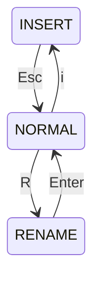

# GIGA

A HeavyWeight text editor written in Rust

> All this README.md file is written using giga !

## A Project

This Repo is a fork from the [original project](https://github.com/florentinl/giga) which was a project for Rust course from CentraleSupélec.

## User Interface


## Installation

make sure you have cargo installed on your machine.

clone the repository:

```Bash
git clone https://github.com/GerfautGE/giga.git && cd giga
````

install the binary:

```Bash
cargo install --path .
```

## Editor

To start editing a file just write in your terminal:

```Bash
giga file.rs
```

You can also create a file and editing it:

```Bash
giga my_new_file.rs
```

If you enter

```Bash
giga
```

It will create a new file called NewFile.

## Mode

Giga is a modal based test editor. You have three modes:

- **NORMAL**
- **INSERT**
- **RENAME**

To toggle modes:

